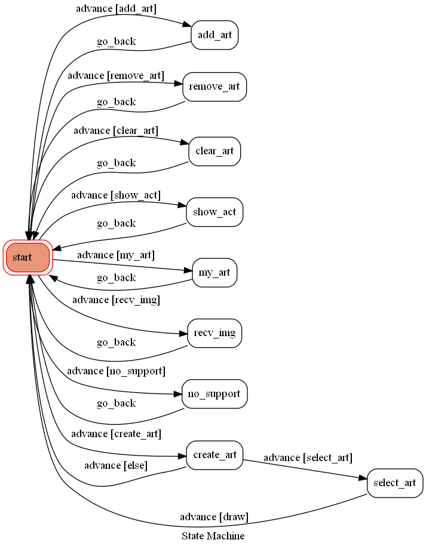

# TOC Project 2020

## Project Name
**基因圖變器**

## Setup

### Prerequisite
* Python 3.9
* Pipenv
* Linebot API
* HTTPS Server
* Fast-Style-Transfer github package
* Imgur
* Sqlite
* BeautifulSoup

#### Install Dependency
```sh
pip install -r requirements.txt
```

#### Secret Data
`config.py` => Config fill in your own token of linebot and imgur

#### run locally

**`ngrok` would be used in the following instruction**

```sh
ngrok http 5000
```

After that, `ngrok` would generate a https URL.

#### Run the sever

* linebot server
```sh
python3 .py
```
* spider and computing server
```sh
python3 server.py
```

## Objective
* increase user's sense of art
* store some unimportant images and no need to use personal storage
* create some creative images that is funny
* let user feel more like an artist
* give user more special image for updating their social media
* get the new information of tainan art musiem

## Finite State Machine


## Command can use
* 創建藝術品
* 近期藝術活動
* 我的畫廊
* 刪除藝術品{編號}
* 清空畫廊
* 放入畫廊 (需要先有上傳照片)

## Example


## Reference
* https://github.com/lengstrom/fast-style-transfer
* https://ithelp.ithome.com.tw/users/20144761/ironman/5735
